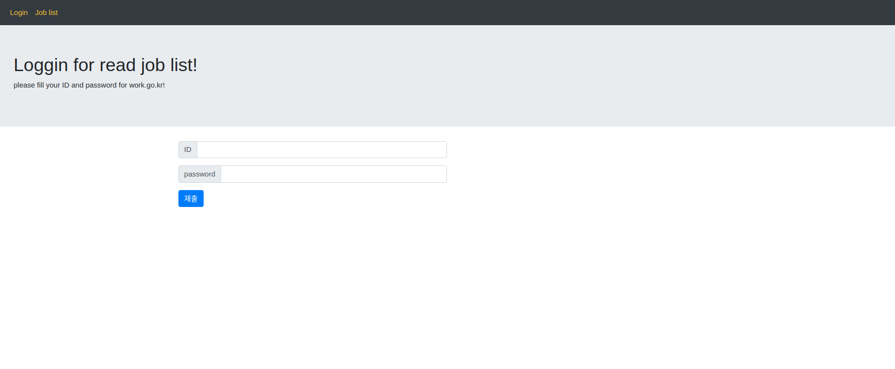
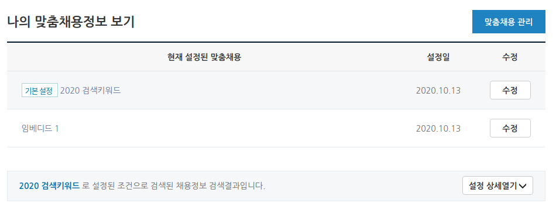

## Worknet 맞춤 취업정보 리스팅 프로젝트
##### goorm io 에서 mongo DB 와 django 를 기반으로한 프로젝트 입니다.
<Br><br>
  


----

## INDEX
*    ### 개발 환경
*    ### 페이지 구성
*    ### 상세 내용

<br>

```
본 프로젝트는 Worknet으로 부터 맞춤 채용정보를 읽어오는 프로젝트 입니다.
Worknet 에서 사전에 필요한 작업은 2가지 입니다.

    1.  Worknet 로그인을 위한 아이디
    2.  마이페이지 - 나의 맞춤정보 - 맞춤 채용관리 탭의 작성

```
<br><br>
# 개발 환경
### - OS : Ubuntu 20.04
### - Language : Python, Html
### - Frame work : Django, Bootstrap


<br><br><br>

# 페이지 구성

프로젝트 파일 경로는 develop/Web_config 이며 Django 로 구성. <br>
동작되는 APP 은 Web_config/job_list 

 <br><br>

*   ### login 을 위한 job/login
  

<br><br><br>

*  ### 채용정보 리스트를 위한 job/list


<br><br>
# 상세 내용

### 1.    Worknet 에서 로그인을 정보 입력을 위한 Login 페이지

본 페이지는 Worknet 의 로그인 정보를 입력받습니다.
아이디와 비밀번호를 입력하면 지정한 맞춤채용 정보에 대한 리스트 페이지로 이동합니다.
아래는 맞춤 채용관리 페이지의 url 과 사진입니다.

<br>
<br>
<br>
<br>

- 페이지 사진과 링크 

https://www.work.go.kr/indivMemberSrv/custmadeInfoMng/custmadeInfoList.do


<br>
<br>

web_config/job_list/views.py 에서 126번 라인의 'seqNo' 의 값을 변경하여 채용정보를 선택가능합니다.
위 사진은 제 개인 페이지의 맞춤채용정보 화면이며, 1번은 '2020검색키워드', 2번은 '임베디드 1'을 의미합니다.
현재 프로젝트의 기본값은 2 로 설정되어있습니다.

<br><br>
- 로그인 페이지 상세 사진


<br>

    worknet의 로그인 정보를 입력하고 제출버튼을 누르면 Worknet 에 등록된 맞춤정보에 따라 검색이 시작되며,
    데이터는 셀레니움을 통해 읽은 후 지정된 ip와 포트에 등록된 mongoDB에 데이터가 저장됩니다.
